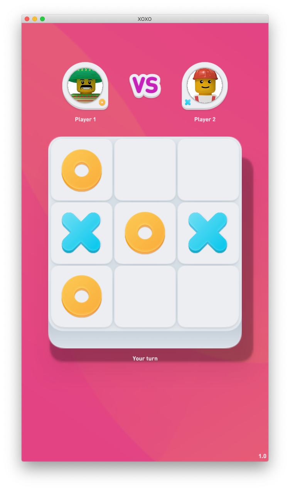

# XOXO - Tic Tac Toe
This is a Tic Tac Toe game made in Defold an intended for testing of different server implementations and backend services. The game has basic game state handling with a main menu and game screen. The screens interact with a backend through a Lua module where the various events and actions (connect, join, move, win etc) are sent from client to server and vice-versa.

Try a hotseat (serverless) version of the game here: https://defold.com/game-xoxo/.
